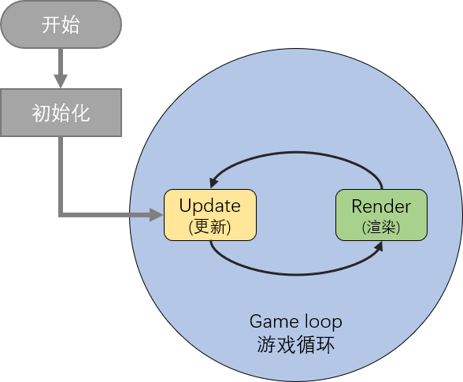

# 游戏循环
Flame中的Game Loop (直译:游戏循环)模块来自于「游戏循环」概念。



绝大多数的游戏基于这两种函数构建：

- render（渲染）函数用于绘制游戏的当前状态。
- update（更新）函数接收自上次update以来的时间增量（以秒为单位）并允许你切换至下个状态。

> 如果你未曾有过游戏开发的经验，可能会认为此概念较为模糊。通俗的讲，`render`处理“能看到的”界面，`update`处理“看不见的”数值等操作。

`Game` 是一个可被继承的 class，并且提供了上述的两种函数。并且`Game`类也会提供一个 `widget` 属性，使你可以轻松将其集成至你的 Flutter 项目！

你可以直接在`runApp`函数中直接渲染 `Game` 类，你也可以扩大你的APP规模，使你的游戏包含路由、其他界面和菜单！

想要使用，只需向下面这样，将 widget 直接添加至 runApp：

```dart
 main() {
   Game game = MyGameImpl();
   runApp(game.widget);
 }
```

Flame 提供了功能更加完善的 `BaseGame` 类和包含物理引擎的 `Box2DGame` 类，建议你直接使用它们作为 Game 类。

TODO